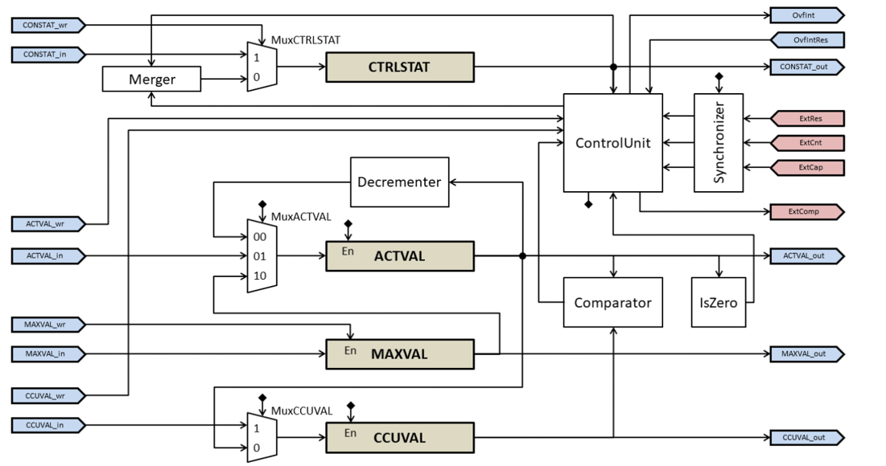

= Dual-Channel Timer User Documentation

Down-counting timer with capture, compare, and overflow interrupt support

== Introduction

The timer provides two independent down-counting channels. Each channel has a
32-bit current value and maximum value. A channel can count from the timer
clock or from an external count input, reload its maximum value when the
counter reaches zero, capture its current value on an external event, and
generate compare outputs for downstream logic.

The timer is accessed through an AHB-Lite register interface. Its external
signals are synchronous to the timer clock after input synchronization, and
the asynchronous active-low reset initializes the timer state.

== Features

** *Two independent channels:* channel 0 and channel 1 have separate counter,
maximum-value, control, and overflow-interrupt logic.

** *Down-counting:* the active value decrements on each enabled count event
until it reaches zero.

** *Selectable count and reset inputs:* external count and reset inputs support
disabled, rising-edge, falling-edge, high-level, low-level, and any-edge
trigger modes.

** *Auto-reset:* when enabled for the reset input, reaching zero reloads the
active value from the maximum value.

** *Capture and compare:* each CCU can capture the active value or compare it
with a programmed value using six comparison relations.

** *Overflow interrupt:* a channel can assert its overflow interrupt when an
automatic or external reset occurs. The interrupt remains asserted until
cleared through the overflow interrupt reset input.

** *Flexible CCU count:* channel 0 provides one capture/compare unit, while
channel 1 provides six units.

== Architecture

The register interface is an AHB-Lite slave interface. The timer accepts the
standard AHB-Lite address, transfer, write-data, and control signals and
returns read data, ready, and response signals. Burst Transfers are not supported and will throw an error if attempted. Timer inputs that may originate
outside the clock domain pass through synchronizers before they affect the
counter or capture logic.

=== Counter and Capture/Compare Model

When enabled, a channel decrements its active value on each clock cycle when
the internal clock is selected, or on each enabled external count event when
`CntIM` selects `ExtCnt`. The counter stops at zero. If `ResIM` is set to
auto-reset, reaching zero loads `MAXVAL` into `ACTVAL`; an enabled external
reset also loads `MAXVAL`. A CPU write to `ACTVAL` has priority over the
hardware counter update.

Each external input is synchronized through two clocked stages. The selected
input mode is then decoded as follows:

[cols="2,3",options="header"]
|===
|Mode
|Meaning
|000
|Disabled; the input has no effect.
|001
|Rising edge.
|010
|Falling edge.
|011
|High level.
|100
|Low level.
|101
|Any edge.
|110
|Reserved.
|111
|Auto-reset for `ResIM`; undefined for other input modes.
|===

When `CCM` is `000`, the CCU is in capture mode and stores `ACTVAL` in its
`CCUVAL` register on the selected capture trigger. In compare modes, `CCUVAL`
is compared with `ACTVAL` and the selected result drives `ExtComp`. Mode `111`
disables capture and compare.

[cols="2,3",options="header"]
|===
|CCM
|Function
|000
|Capture `ACTVAL` on the capture trigger; `ExtComp` is low.
|001
|`ACTVAL < CCUVAL`.
|010
|`ACTVAL <= CCUVAL`.
|011
|`ACTVAL > CCUVAL`.
|100
|`ACTVAL >= CCUVAL`.
|101
|`ACTVAL == CCUVAL`.
|110
|`ACTVAL != CCUVAL`.
|111
|Capture/compare disabled.
|===

When the active value reaches zero and auto-reset is enabled, the channel
raises `OvfInt` when overflow interrupts are enabled. The interrupt remains
asserted until the corresponding `OvfIntRes` input clears it.

== Programming

=== Per-Channel Configuration and Status

** *TimEn:* enables the channel counter.

** *ResIM:* selects the trigger mode for the external reset input. Mode `111`
enables automatic reload when `ACTVAL` reaches zero.

** *CntIM:* selects the trigger mode for the external count input. When this
field is disabled, the timer clock supplies the count events.

** *OvfIntEn:* enables the channel overflow interrupt output.

** *ACTVAL:* current counter value. Software can read or write it; hardware
updates it while the channel is operating.

** *MAXVAL:* value loaded into `ACTVAL` by an enabled reset or auto-reset.

** *CCM<n>:* selects capture mode, one of six compare relations, or disabled
mode for CCU `<n>`.

** *CapIM<n>:* selects the trigger mode for the external capture input of CCU
`<n>`.

** *CCUVAL<n>:* compare value in compare mode, or captured `ACTVAL` in capture
mode. Software writes the compare value and reads the captured value.

=== Register and Bitfield Reference

The `TimerCSC` interface contains 20 32-bit registers and 33 bitfields. `SwRd`,
`SwWr`, `HwRd`, and `HwWr` indicate whether software or hardware can read or
write a field. For repeated CCU fields, `<n>` is the unit number shown in the
register name.

[cols="1,1,3,2,1,1,1,1,1",options="header"]
|===
|Register
|Offset
|Bitfield(s)
|Position
|Size
|SwRd
|SwWr
|HwRd
|HwWr
|CH0_CTRLSTAT
|0x00
|TimEn_CH0, ResIM_CH0, CntIM_CH0, OvfIntEn_CH0
|0, 1, 4, 7
|1, 3, 3, 1
|T
|T
|T
|F
|CH0_ACTVAL
|0x04
|ACTVAL_CH0
|0
|32
|T
|T
|T
|T
|CH0_MAXVAL
|0x08
|MAXVAL_CH0
|0
|32
|T
|T
|T
|F
|CH0_CCUCTRL0
|0x0c
|CCM0_CH0, CapIM0_CH0
|0, 3
|3, 3
|T
|T
|T
|F
|CH0_CCUVAL0
|0x10
|CCUVAL0_CH0
|0
|32
|T
|T
|T
|T
|CH1_CTRLSTAT
|0x14
|TimEn_CH1, ResIM_CH1, CntIM_CH1, OvfIntEn_CH1
|0, 1, 4, 7
|1, 3, 3, 1
|T
|T
|T
|F
|CH1_ACTVAL
|0x18
|ACTVAL_CH1
|0
|32
|T
|T
|T
|T
|CH1_MAXVAL
|0x1c
|MAXVAL_CH1
|0
|32
|T
|T
|T
|F
|CH1_CCUCTRL0
|0x20
|CCM0_CH1, CapIM0_CH1
|0, 3
|3, 3
|T
|T
|T
|F
|CH1_CCUVAL0
|0x24
|CCUVAL0_CH1
|0
|32
|T
|T
|T
|T
|CH1_CCUCTRL1
|0x28
|CCM1_CH1, CapIM1_CH1
|0, 3
|3, 3
|T
|T
|T
|F
|CH1_CCUVAL1
|0x2c
|CCUVAL1_CH1
|0
|32
|T
|T
|T
|T
|CH1_CCUCTRL2
|0x30
|CCM2_CH1, CapIM2_CH1
|0, 3
|3, 3
|T
|T
|T
|F
|CH1_CCUVAL2
|0x34
|CCUVAL2_CH1
|0
|32
|T
|T
|T
|T
|CH1_CCUCTRL3
|0x38
|CCM3_CH1, CapIM3_CH1
|0, 3
|3, 3
|T
|T
|T
|F
|CH1_CCUVAL3
|0x3c
|CCUVAL3_CH1
|0
|32
|T
|T
|T
|T
|CH1_CCUCTRL4
|0x40
|CCM4_CH1, CapIM4_CH1
|0, 3
|3, 3
|T
|T
|T
|F
|CH1_CCUVAL4
|0x44
|CCUVAL4_CH1
|0
|32
|T
|T
|T
|T
|CH1_CCUCTRL5
|0x48
|CCM5_CH1, CapIM5_CH1
|0, 3
|3, 3
|T
|T
|T
|F
|CH1_CCUVAL5
|0x4c
|CCUVAL5_CH1
|0
|32
|T
|T
|T
|T
|===